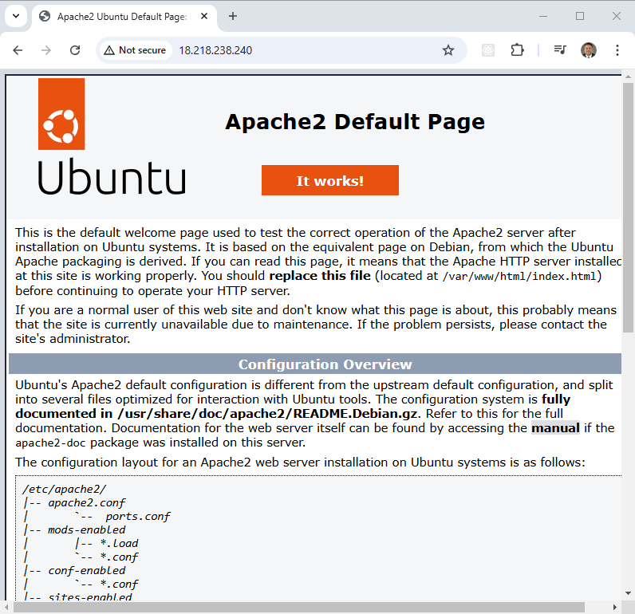

Google Cloud Terraform Setup Instructions
=========================================

This project complements a video on my channel that demonstrates how to configure Terraform with GCP.

An Ubuntu virtual machine (VM Instance) is deployed, and a [startup_script](scripts/startup_script.sh) script is used to install Apache during the instance's boot process.

## Download this Repository

```bash
git clone https://github.com/mamonaco1973/gcp-setup.git
cd gcp-setup
```

## Prerequisites

* [Install gcloud CLI](https://cloud.google.com/sdk/docs/install) 
* [Install Latest Terraform](https://developer.hashicorp.com/terraform/install)
* [Install Latest Packer](https://developer.hashicorp.com/packer/install)

NOTE: Make sure the gcloud, packer and terraform commands are all in your $PATH.

The [check_env](./check_env.sh) script will validate this is set correctly when you run the terraform build.

## GCP Account

If you don't already have a GCP account you'll need to create an Account for this project. 

[Create an Account](https://console.cloud.google.com/)

## Create a GCP Project

Steps to Create a New GCP Project from the Google Cloud Console

### 1. Log In to Google Cloud Console
- Visit the [Google Cloud Console](https://console.cloud.google.com).
- Log in with your Google account.

### 2. Navigate to the Project Selector
- In the top navigation bar, click on the **Project Selector** dropdown (next to the Google Cloud logo).

### 3. Click on “New Project”
- In the dropdown, click the **New Project** button at the top.

### 4. Fill Out Project Details
- **Project Name**: Enter a unique name for your project.
- **Billing Account** (if applicable): Select a billing account for the project.
- **Organization**: Choose an organization (or leave it as "No Organization" for personal accounts).
- **Location (Parent Resource)**: Choose a folder or organization if required.

### 5. Click “Create”
- After entering all the details, click the **Create** button.

### 6. Wait for the Project to be Created
- Wait a few moments for the project to be created. Once completed, it will appear in the **Project Selector** dropdown.

## Create a Service Account

### 1. Log in to the Google Cloud Console
   - Navigate to [Google Cloud Console](https://console.cloud.google.com).
   - Ensure you are logged in with a user account that has appropriate permissions to manage IAM and service accounts.

### 2. Select the Project
   - At the top of the console, click on the project selector dropdown.
   - Choose the project where you want to create the Terraform identity.

### 3. Create a Service Account
   - Go to **IAM & Admin** > **Service Accounts** in the navigation menu.
   - Click the **Create Service Account** button.
   - Fill in the details:
     - **Service Account Name**: A descriptive name (e.g., `terraform-sa`).
     - **Service Account ID**: Automatically generated based on the name.
     - **Description**: Optional but recommended (e.g., `Service account for Terraform deployments`).
   - Click **Create and Continue**.

### 4. Assign Permissions (Roles)
   - Assign the necessary roles to the service account. Common roles for Terraform include:
     - **Viewer**: For reading existing resources.
     - **Editor**: For creating and modifying resources.
     - **Owner**: For full project access and terraform builds.
   - Click **Continue** after assigning the roles.

### 5. Generate a Key for the Service Account
   - After creating the service account, locate it in the **Service Accounts** list.
   - Click the **More actions** menu (three dots) next to the service account, then select **Manage Keys**.
   - Click **Add Key** > **Create New Key**.
   - Select **JSON** as the key type.
   - Click **Create**, and a JSON key file will be downloaded to your machine. Keep this file secure.
   - Rename this file "credentials.json" and put this file in the root directory of the project. Run [check_env](check_env.sh) to validate your credentials.

## Activate the required APIs and wait a bit

Run the script [api_setup](./api_setup.sh) to activate all the project APIs needed. After updating wait about 5 minutes for all the APIs to become available. Running your terraform code before this is complete will cause errors.

```bash
~/gcp-setup$ ./api_setup.sh
NOTE: Validating credentials.json and test the gcloud command
Activated service account credentials for: [terraform-build@debug-project-446221.iam.gserviceaccount.com]
NOTE: Enabling APIs needed for build.
Updated property [core/project].
azureuser@develop-vm:~/gcp-setup$
```

## Run the "apply" script

**Make sure you have created the file "credentials.json" in the root directory of the project.** This file is in the `.gitignore` list so it will not be pushed into source control.

```bash
~/gcp-setup$ ./apply.sh
NOTE: Validating that required commands are found in the PATH.
NOTE: gcloud is found in the current PATH.
NOTE: packer is found in the current PATH.
NOTE: terraform is found in the current PATH.
NOTE: All required commands are available.
NOTE: Validating credentials.json and test the gcloud command
Activated service account credentials for: [terraform-build@debug-project-446221.iam.gserviceaccount.com]
Initializing the backend...
Initializing provider plugins...
- Finding latest version of hashicorp/google...
- Installing hashicorp/google v6.14.1...
- Installed hashicorp/google v6.14.1 (signed by HashiCorp)
Terraform has created a lock file .terraform.lock.hcl to record the provider
selections it made above. Include this file in your version control repository
so that Terraform can guarantee to make the same selections by default when
you run "terraform init" in the future.

Terraform has been successfully initialized!

You may now begin working with Terraform. Try running "terraform plan" to see
any changes that are required for your infrastructure. All Terraform commands
should now work.

If you ever set or change modules or backend configuration for Terraform,
rerun this command to reinitialize your working directory. If you forget, other
commands will detect it and remind you to do so if necessary.
data.google_compute_image.ubuntu_latest: Reading...
data.google_compute_image.ubuntu_latest: Read complete after 1s [id=projects/ubuntu-os-cloud/global/images/ubuntu-2404-noble-amd64-v20241219]
[...]
```

## Test the build

Once built a VM called `setup-vm` will be created and will be publicly available. The output of the terraform will be the public IP address

You can `SSH` to that instance with the "[Private_Key](keys\Private_Key)".

You can also open a web browser and see that apache has been deployed - This can take up to 5 minutes to initialize.



## Run the "destroy" script when you are done

```bash
~/gcp-setup$ ./destroy.sh
Initializing the backend...
Initializing provider plugins...
- Reusing previous version of hashicorp/google from the dependency lock file
- Using previously-installed hashicorp/google v6.14.1

Terraform has been successfully initialized!

You may now begin working with Terraform. Try running "terraform plan" to see
any changes that are required for your infrastructure. All Terraform commands
should now work.

If you ever set or change modules or backend configuration for Terraform,
rerun this command to reinitialize your working directory. If you forget, other
commands will detect it and remind you to do so if necessary.
google_compute_firewall.allow_http: Refreshing state... [id=projects/debug-project-446221/global/firewalls/allow-http]
google_compute_firewall.allow_ssh: Refreshing state... [id=projects/debug-project-446221/global/firewalls/allow-ssh]
data.google_compute_image.ubuntu_latest: Reading...
[...]
```
